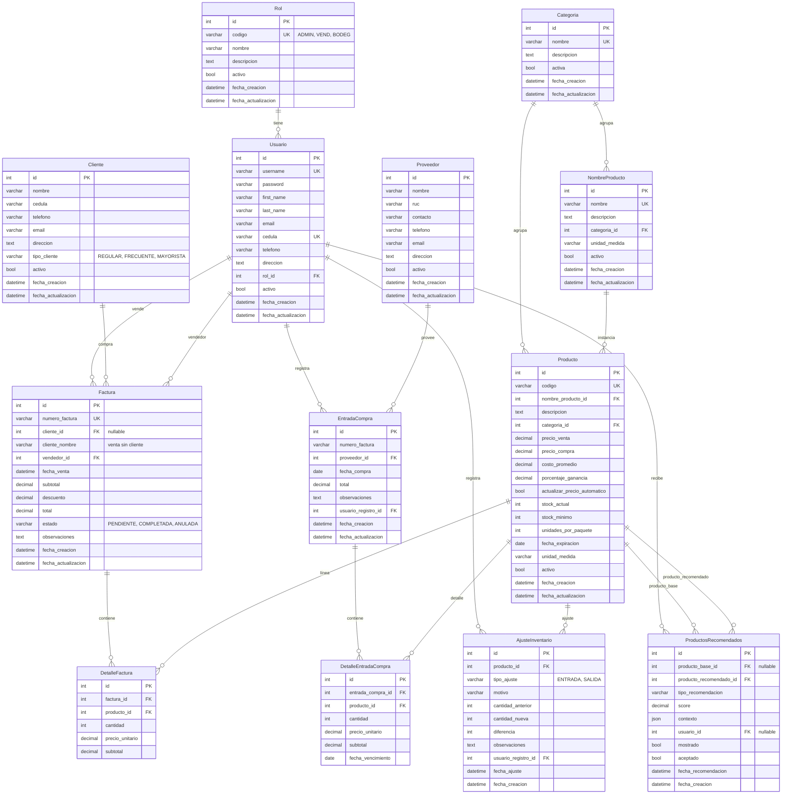

# Diagrama de Base de Datos Relacional - Sistema de Inventario Mini

## Diagrama ER (Entidad-Relación)

## Resumen de tablas por módulo

| Módulo        | Tablas |
|---------------|--------|
| **usuarios**  | Rol, Usuario |
| **inventario**| Categoria, NombreProducto, Producto, Proveedor, EntradaCompra, DetalleEntradaCompra, AjusteInventario |
| **ventas**    | Cliente, Factura, DetalleFactura |
| **ciencia_datos** | ProductosRecomendados |

## Cardinalidades principales

- **Rol** → **Usuario**: 1:N (un rol tiene muchos usuarios).
- **Usuario** → **Factura**: 1:N (un vendedor tiene muchas facturas).
- **Cliente** → **Factura**: 1:N (un cliente puede tener muchas facturas; factura puede no tener cliente).
- **Factura** → **DetalleFactura**: 1:N (una factura tiene muchas líneas).
- **Producto** → **DetalleFactura**: 1:N (un producto aparece en muchas líneas de factura).
- **Categoria** → **NombreProducto** / **Producto**: 1:N.
- **NombreProducto** → **Producto**: 1:N (varios productos pueden compartir el mismo nombre/catálogo).
- **Proveedor** → **EntradaCompra**: 1:N.
- **EntradaCompra** → **DetalleEntradaCompra**: 1:N.
- **Producto** → **DetalleEntradaCompra**, **AjusteInventario**: 1:N.
- **Producto** → **ProductosRecomendados**: N:M vía producto_base y producto_recomendado.

## Notas

- **Usuario** extiende `AbstractUser` de Django (incluye username, password, first_name, last_name, email, is_staff, is_active, date_joined, etc.).
- **unique_together**: (factura, producto) en DetalleFactura; (entrada_compra, producto) en DetalleEntradaCompra.
- Claves foráneas con `PROTECT` impiden borrar el registro referenciado si hay dependencias; `CASCADE` borra en cascada (ej. detalle al borrar factura).
